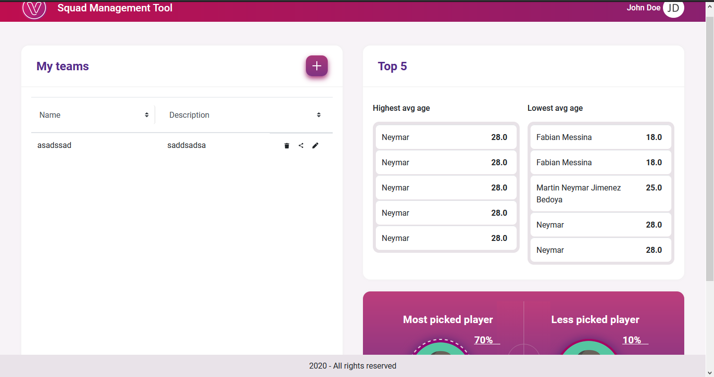
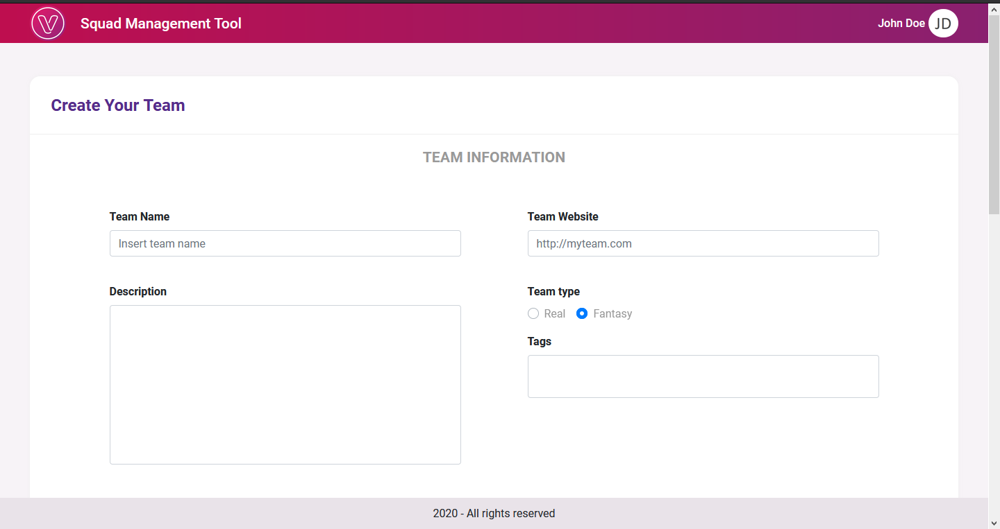
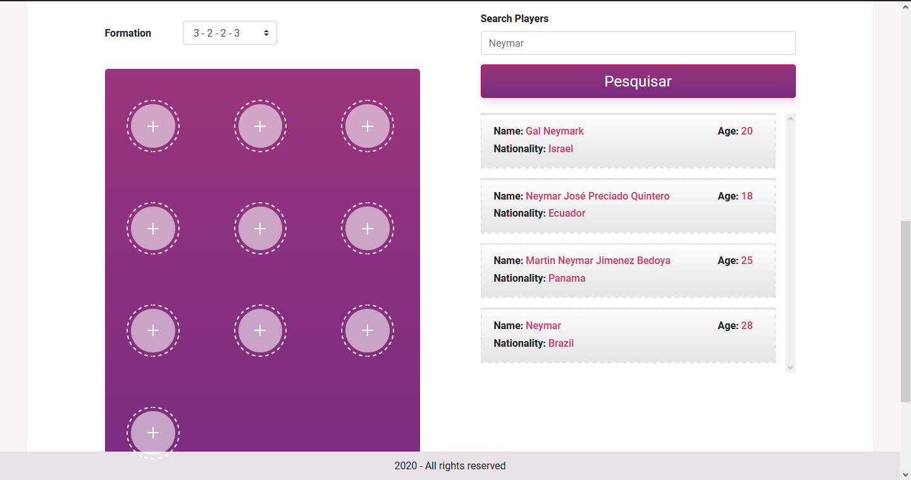

<div style="display: flex;">
  
  
  
</div>
<h3 align="center">Squad</h3>

<div align="center">

[]()
[](https://github.com/kylelobo/The-Documentation-Compendium/issues)
[](https://github.com/kylelobo/The-Documentation-Compendium/pulls)
[](LICENSE.md)

</div>

---

<p align="center"> 
Project developed as a test for the company venturus, the intuition of the project is to demonstrate my knowledge in Frontend.<br>
</p>

## 📝 Table of Contents

- [Idea / Solution](#idea)
- [Dependencies](#dependencies)
- [Limitations](#limitations)
- [Future Scope](#future_scope)
- [Setting up a local environment](#getting_started)
- [Usage](#usage)
- [Contributing](../CONTRIBUTING.md)
- [Authors](#authors)
- [Acknowledgments](#acknowledgments)

requirements that will lead to a winning solution.

## 💡 Idea / Solution <a name = "idea"></a>

The idea is exclusively from Venturus.

This little system is for the user to display his team using any player he wants.

## ⛓️ Limitations <a name = "limitations"></a>

- Limitations:
> - The Top5 table should show a list containing the highest and lowest ages of its players, but it is currently showing only a list of the highest and lowest ages of the last team creation
> - No unit tests have been written.
> - The code is not 100% clean.
> - Everything is saved in localStorage, but the recommended for a real project would be NodeJs + MongoDB
- Why each limitation exists
> - I didn't have much time to solve everything, but I have enough skills to solve it.

## 🚀 Future Scope <a name = "future_scope"></a>

Deploy the website and connected with some database and go up to some hosting platform.

## 🏁 Getting Started <a name = "getting_started"></a>

These instructions will get you a copy of the project up and running on your local machine for development
and testing purposes. See [deployment](#deployment) for notes on how to deploy the project on a live system.

### Prerequisites

- NPM, 
- VSCode

### Installing

Step by Step.

At first moment you must install with:

```
npm install
```

And start this project with:

```
npm start
```

## 🎈 Usage <a name="usage"></a>

Add notes about how to use the system.

## ⛏️ Built With <a name = "dependencies"></a>

- [ReactJs](https://pt-br.reactjs.org/) - Web Framework
- [axios](https://www.npmjs.com/package/axios) - to fetch API
- [React-icons](https://react-icons.github.io/react-icons/) - to use svg icons
- [Styled-components](https://styled-components.com/) - Amazing stylizing method
- [Bootstrap](https://getbootstrap.com/) - Bootstrap 
- [React-bootstrap](https://react-bootstrap.github.io/) - way to merge the bootstrap with react

## ✍️ Authors <a name = "authors"></a>

- Venturus - Idea
- [@paulopkl](https://github.com/paulopkl) - Initial work

## 🎉 Acknowledgments <a name = "acknowledgments"></a>

- Venturus - for opportunity
- Inspiration - too much hours of studying and read documentations